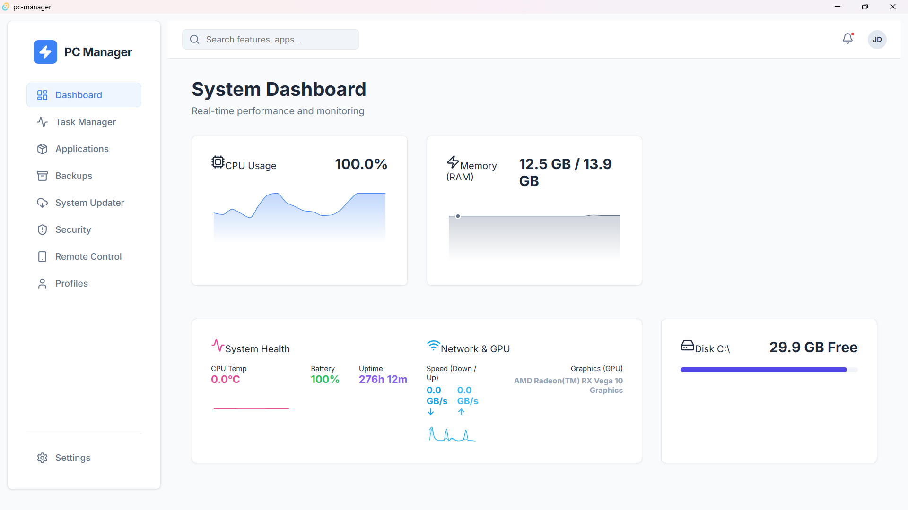

# 🚀 PC Manager - Advanced System Management Suite

PC Manager is a powerful, cross-platform desktop application built with **Tauri**, **Rust**, and **React**. It features a premium **"Liquid Glass"** design aesthetic—a modern, refractive UI with vibrant gradients and smooth animations.



## ✨ Features

### 📊 Real-Time Dashboard
*   Live monitoring of CPU, RAM, Network, and Disk usage.
*   Hardware identification (CPU & GPU details).
*   Dynamic system uptime tracking.

### 🛠️ Advanced Task Manager
*   Real-time process listing with resource usage.
*   Single-click "End Task" functionality for unresponsive apps.

### 📦 Application & Backup Manager
*   Smart uninstaller with registry and residual folder cleanup.
*   **Automatic Backups:** Save app data to `Desktop/PCManager_Backups` before removal.
*   **Restore System:** Reinstall app data with one click.

### 🛡️ Security Suite
*   Integrated Windows Defender scan triggers.
*   Threat detection and removal system.
*   Native OS notifications for security alerts.

### 📱 Remote Control
*   **Mobile Pairing:** Control your PC from your phone via QR code.
*   **Live View:** Real-time stats and mouse control from any mobile browser.
*   **Auto-Sync:** Dynamic port management and connection security.

### 👤 Profiles & Automation
*   **Performance Profiles:** Switch between Silent, Balanced, and Turbo (High Performance) modes.
*   **Game Mode:** Custom checklists to close background distractions (Chrome, Discord, etc.) and boost system power.
*   **Focus Mode:** Instantly clear your desktop (Minimize all windows) and silence notifications.

## 🛠️ Tech Stack

*   **Frontend:** React, Framer Motion (Animations), Lucide (Icons)
*   **Backend:** Rust, Tauri
*   **Styling:** Vanilla CSS (Liquid Glass Theme)
*   **Networking:** WebSockets (Remote Control)

## 🚀 Getting Started

### Prerequisites
*   [Node.js](https://nodejs.org/) (v18+)
*   [Rust](https://www.rust-lang.org/tools/install) (v1.70+)
*   Tauri build dependencies (See [Tauri Setup](https://tauri.app/v1/guides/getting-started/prerequisites))

### Installation
1. Clone the repository
2. Install dependencies:
   ```bash
   npm install
   ```
3. Run in development mode:
   ```bash
   npm run tauri dev
   ```

### Building for Production
```bash
npm run tauri build
```

## 🔒 Security
PC Manager requires Administrator privileges for some features (Process management, Power plan switching, System updates). 

## 📄 License
MIT License - Copyright (c) 2026
